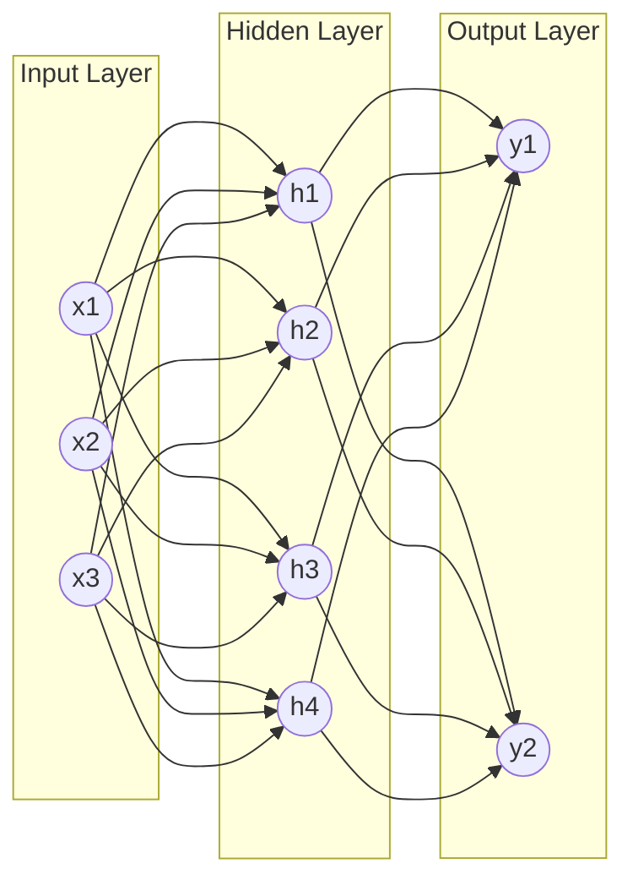

# Neural network fundamentals

A neural network is a stack of simple weighted-sum-plus-nonlinearity calculations, layered and trained until the whole stack approximates some function — an LLM's billions of "parameters" are exactly this: the weights and biases of one (very large) network, nothing more exotic underneath.

## Prerequisites
- [[what-is-an-llm]]

## In plain English

Zoom into a single "neuron" in a neural network and there's nothing mysterious there: it takes a handful of numeric inputs, multiplies each by a learned **weight**, adds a learned **bias**, sums it all up, and passes the result through a small nonlinear function called an **activation function**. That's it — one neuron is a few multiplications, an addition, and a squashing function.

The power comes from stacking millions or billions of these. Neurons are arranged in **layers**: an input layer (the raw numbers going in — for an LLM, a token's embedding), one or more **hidden layers** (each neuron takes every neuron's output from the layer before it as input), and an output layer (the final numbers the network produces — for an LLM, a probability for every possible next token). Data flows in one direction through this stack during use — the **forward pass** — and the network's "knowledge" is entirely encoded in the specific weight and bias values sitting on every connection between neurons.

Those weights don't start out meaningful — they start random. **Training** is the process of nudging every weight and bias, a tiny bit at a time, so the network's output gets statistically closer to what it should have been on a huge pile of examples. The mechanism (**backpropagation** + **gradient descent**, at a conceptual level, no calculus required to use this idea): run a forward pass, compare the output to the correct answer with a **loss function**, then work backward through the network computing how much each weight contributed to the error, and adjust every weight slightly in the direction that reduces it. Repeat this millions of times over a huge dataset and the random initial weights slowly become a network that's actually good at the task. This is precisely what "training an LLM" means — the "next-token predictor" described in [[what-is-an-llm]] is a neural network, and its weights are exactly what gradient descent spent enormous compute adjusting during training.



## Core mechanics

| Concept | What it means |
|---|---|
| Neuron | Weighted sum of its inputs, plus a bias, passed through an activation function — the atomic unit of the network |
| Weight | A learned number scaling one connection between two neurons — the vast majority of what "parameters" refers to in "an N-billion-parameter model" |
| Bias | A learned per-neuron offset added after the weighted sum, before the activation function |
| Activation function | The nonlinearity applied after the weighted sum (e.g. ReLU inside hidden layers; softmax at an LLM's output layer, turning raw scores into a probability distribution over the vocabulary) — without it, stacking layers would collapse mathematically into one big linear function, no matter how many layers deep |
| Layer | A group of neurons that all take the same inputs (the previous layer's outputs) and feed the same next layer |
| Forward pass | Running input through every layer in order to produce an output — this is what "inference" (see [[what-is-an-llm]]) actually executes |
| Loss function | A number quantifying how wrong the network's output was on one example — training exists to drive this number down |
| Backpropagation | The algorithm for computing how much each weight contributed to the loss, working backward from the output layer to the input layer |
| Gradient descent | Using those per-weight contributions to nudge every weight slightly in the direction that reduces the loss, repeated over many training examples |
| Parameters | The total count of every weight and bias in the network — this is the number quoted as a model's size (e.g. "8B parameters") |

## Sample code

There's no lab cell demonstrating this — none of this course's labs or presentation decks train a neural network from scratch; the stack works entirely against already-trained models via API calls. The mechanism worth internalizing is the shape of one neuron's math, since every layer in a real network is just this repeated and stacked:

```python
def neuron(inputs: list[float], weights: list[float], bias: float) -> float:
    """One neuron's forward pass: weighted sum + bias, then an activation."""
    z = sum(w * x for w, x in zip(weights, inputs)) + bias
    return relu(z)  # or softmax, sigmoid, etc. depending on the layer

def relu(z: float) -> float:
    return max(0.0, z)
```

A real network layer is this same computation done for every neuron in the layer at once (in practice, a matrix multiply — `layer_output = activation(inputs @ weight_matrix + bias_vector)` — which is why GPUs, built for fast matrix math, are what makes training and running these networks practical at scale).

## How this shows up in the capstone

Nothing in the capstone trains a network from scratch — Groq and Gemini are called as managed inference APIs (see [[what-is-an-llm]], [[raw-llm-clients]]), so this page is foundational/interview theory rather than code you'll write in this course. It's the mental model underneath every `litellm.completion()` call: what's actually running on the provider's hardware when a request comes in.

## Interview fire round

- **Q: What's the difference between a model's "parameters" and its "hyperparameters"?**
  A: Parameters (weights and biases) are learned automatically during training. Hyperparameters (learning rate, number of layers, batch size, temperature at inference time) are set by whoever builds or runs the model — training doesn't learn these itself.
- **Q: Why does a network need a nonlinear activation function at all — why not just sum the weights?**
  A: Stacking purely linear layers (no nonlinearity) is mathematically equivalent to one single linear layer, no matter how many layers you stack — the nonlinearity is what lets a deep network represent genuinely complex, non-linear functions instead of collapsing into one big linear equation.

## Production gotchas & best practices

- Production practice: "more parameters" isn't automatically "better" for a given task — a larger network costs more to run (compute, memory, latency) per inference, which is exactly the tradeoff [[model-selection-cost-latency-tradeoffs]] covers for choosing between models in this stack.
- Production practice: this course's stack never trains or fine-tunes a network's weights directly — see [[fine-tuning-vs-rag]] for when adjusting a model's actual weights (versus prompting or retrieval) is the right lever to pull at all.

## Course vs. production

The labs treat this layer as already solved — every model called via LiteLLM is fully pre-trained, and no lab trains or fine-tunes a network. In production, teams building agent systems on top of foundation models (as this course does) almost never touch this layer directly either; it matters mainly for interview-level understanding of what a "model" is, and for informed decisions about model size/cost tradeoffs, not for day-to-day capstone code.

## Related
- **Builds on** — [[what-is-an-llm]]
- **Feeds into** — [[transformer-architecture-and-attention]]

## Sources

**Web sources**
- [3Blue1Brown — But what is a neural network? (video)](https://www.3blue1brown.com/lessons/neural-networks) — neuron/layer/weight/bias framing and the visual intuition this page's plain-English section follows, accessed 2026-08-24
- [Michael Nielsen — Neural Networks and Deep Learning, ch. 1-2](http://neuralnetworksanddeeplearning.com/chap1.html) — backpropagation and gradient descent explained without requiring prior calculus background, accessed 2026-08-24
