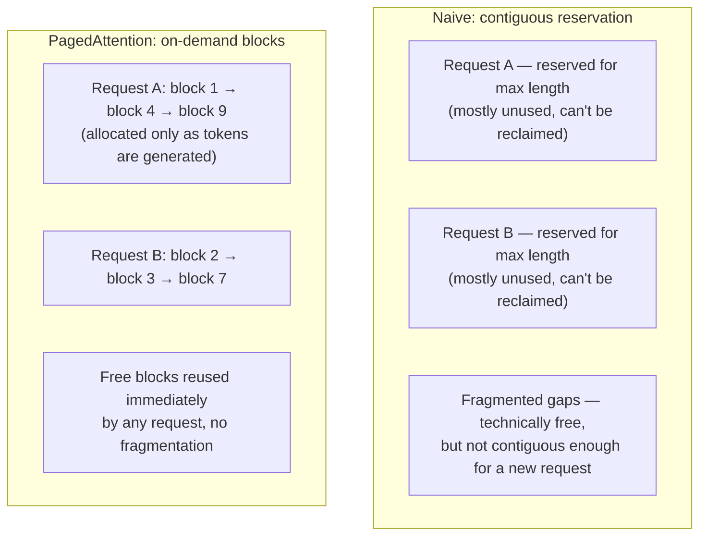

# PagedAttention and efficient serving

PagedAttention is the memory-management technique (introduced by the vLLM project) that made serving many concurrent LLM requests dramatically more efficient, by borrowing the same idea operating systems use for virtual memory — fixed-size pages, allocated on demand — and applying it to the KV cache instead of letting each request reserve one big contiguous, mostly-wasted block.

## Prerequisites
- [[prefill-decode-and-kv-cache]]

## In plain English

[[prefill-decode-and-kv-cache]] covers *why* the KV cache exists and *why* it grows with sequence length. This page covers a real problem that growth causes at serving scale, and the fix now used by most production LLM-serving systems.

The naive way to manage KV cache memory is to reserve one contiguous chunk of GPU memory per request, sized for the *maximum* sequence length that request could possibly reach. Two things go wrong with that: most requests never generate anywhere near the maximum length, so a huge fraction of that reserved memory sits unused for the whole request — pure waste. And because each request's reservation has to be one unbroken block, memory gets fragmented over time as requests of different sizes start and finish, the same way a hard drive fragments — even when the *total* free memory across the GPU would technically be enough for a new request, it might not be available as one contiguous piece. Both effects shrink how many requests a server can actually run at once, which directly limits throughput and drives up cost per request.

**PagedAttention**'s fix: instead of one contiguous reservation, split each request's KV cache into small, fixed-size **blocks** (pages), allocated on demand as generation actually needs them — not upfront for a worst-case length. A **block table** per request tracks which physical memory blocks belong to it, so the blocks themselves never need to be contiguous in GPU memory, exactly like how an operating system's virtual memory lets a process's pages live scattered across physical RAM while the process still sees one clean address space. This eliminates the waste from over-reservation and the fragmentation from requiring contiguous blocks — which means substantially more requests fit in the same GPU memory, so a server can batch far more of them together at once. This pairs with **continuous batching** (new requests join and finished ones leave an in-flight batch continuously, rather than waiting for a fixed batch to fully complete before starting the next one) as the other half of the throughput story in modern LLM-serving engines like vLLM.



## Core mechanics

| Concept | What it means |
|---|---|
| KV cache fragmentation | GPU memory left unusable because free space is scattered in pieces too small/non-contiguous for a new request's reservation — the naive-allocation failure mode PagedAttention targets |
| Block (page) | A small, fixed-size chunk of KV cache memory, allocated to a request on demand — the unit PagedAttention manages instead of one big contiguous reservation |
| Block table | Per-request mapping from logical token positions to the physical (possibly scattered) memory blocks holding their K/V — the indirection layer that makes non-contiguous storage transparent to the attention computation |
| Continuous batching | Requests join and leave an in-flight batch as they arrive/finish, rather than a server waiting for a fixed batch to fully complete before starting the next — the throughput optimization PagedAttention's memory savings make more room for |
| Throughput vs. latency (serving) | More concurrent requests batched together generally raises total tokens/sec served (throughput) but can add queuing delay to any individual request (latency) — a real tradeoff serving systems tune, not a free win in both directions at once |

## Sample code

There's no lab cell demonstrating this — this course's labs call managed inference APIs (Groq, Gemini) where PagedAttention-style memory management, if used, happens entirely inside the provider's serving stack and isn't something application code configures. The concept worth internalizing is the allocation shape it replaces:

```python
# Naive: one contiguous reservation sized for the worst case.
# Most of this is never used, and it can't be given to another
# request until this one fully finishes.
reserve_contiguous_memory(request_id, size=MAX_SEQUENCE_LENGTH)

# PagedAttention-style: allocate fixed-size blocks on demand,
# only as tokens are actually generated, tracked via a block table
# so the blocks themselves don't need to be contiguous.
block_table[request_id] = []
def on_new_token(request_id):
    if current_block_full(request_id):
        new_block = allocate_free_block()   # from a shared pool, reused across requests
        block_table[request_id].append(new_block)
```

## How this shows up in the capstone

Groq and Gemini are managed inference providers — whatever memory-management technique they run underneath (PagedAttention or otherwise) is invisible to the capstone's API calls. This page is serving/infrastructure background rather than something the capstone's code touches directly: relevant for understanding why a provider can serve many concurrent requests affordably, and for interview questions about how production LLM-serving systems (vLLM, TGI, and the engines behind managed APIs) actually work under the hood.

## Interview fire round

- **Q: What two problems does naive, contiguous KV-cache allocation cause at serving scale?**
  A: Over-reservation waste (each request reserves memory for the worst-case sequence length it might never reach) and fragmentation (free memory scattered in pieces too small or non-contiguous to satisfy a new request's reservation, even when total free memory would be enough).
- **Q: What idea does PagedAttention borrow from operating systems, and what does it map onto in LLM serving?**
  A: Virtual memory paging — fixed-size pages allocated on demand, tracked via a table that lets logical addresses map to scattered physical memory. In PagedAttention, the KV cache is the memory being paged: fixed-size blocks allocated per request as generation actually needs them, tracked via a per-request block table.
- **Q: Why does reducing KV-cache waste translate into higher serving throughput, not just "saved memory"?**
  A: GPU memory is the hard limit on how many requests can be processed concurrently — less wasted memory per request means more requests fit in the same GPU memory at once, which is what continuous batching then turns into more total tokens/sec served.

## Production gotchas & best practices

- Production practice: when comparing LLM-serving frameworks (vLLM, TGI, a cloud provider's managed endpoint) for a self-hosted deployment, whether the engine implements paged/blocked KV-cache management is a real throughput differentiator worth asking about directly, not an implementation detail to ignore.
- Production practice: throughput gains from better batching (continuous batching, larger effective batch sizes from freed-up memory) can come at the cost of higher latency variance for any single request under load — a system-design tradeoff to make explicitly, not discover in production.
- Gotcha: this is a serving-layer optimization, not a model-quality one — PagedAttention changes how efficiently a fixed model serves more requests on the same hardware; it doesn't change what the model outputs for a given input.

## Course vs. production

The labs and decks never touch self-hosted inference serving — every call in this course goes to a managed API (Groq, Gemini) where this layer is entirely the provider's concern. In production, teams that self-host open-weight models (an alternative this KB's [[fine-tuning-vs-rag]] and [[model-selection-cost-latency-tradeoffs]] pages touch on) live inside this exact tradeoff daily — serving-engine choice and KV-cache efficiency are first-order cost and throughput decisions, not background trivia.

## Related
- **Builds on** — [[prefill-decode-and-kv-cache]]
- **Related** — [[model-selection-cost-latency-tradeoffs]] (serving efficiency is part of why providers price and rate-limit the way they do)

## Sources

**Web sources**
- [Kwon et al. — Efficient Memory Management for Large Language Model Serving with PagedAttention (arXiv 2309.06180)](https://arxiv.org/abs/2309.06180) — the PagedAttention paper itself: fragmentation problem, block/page design, block tables, throughput results, accessed 2026-08-24
- [vLLM Project — Documentation](https://docs.vllm.ai/) — PagedAttention and continuous batching as implemented in the vLLM serving engine, accessed 2026-08-24
