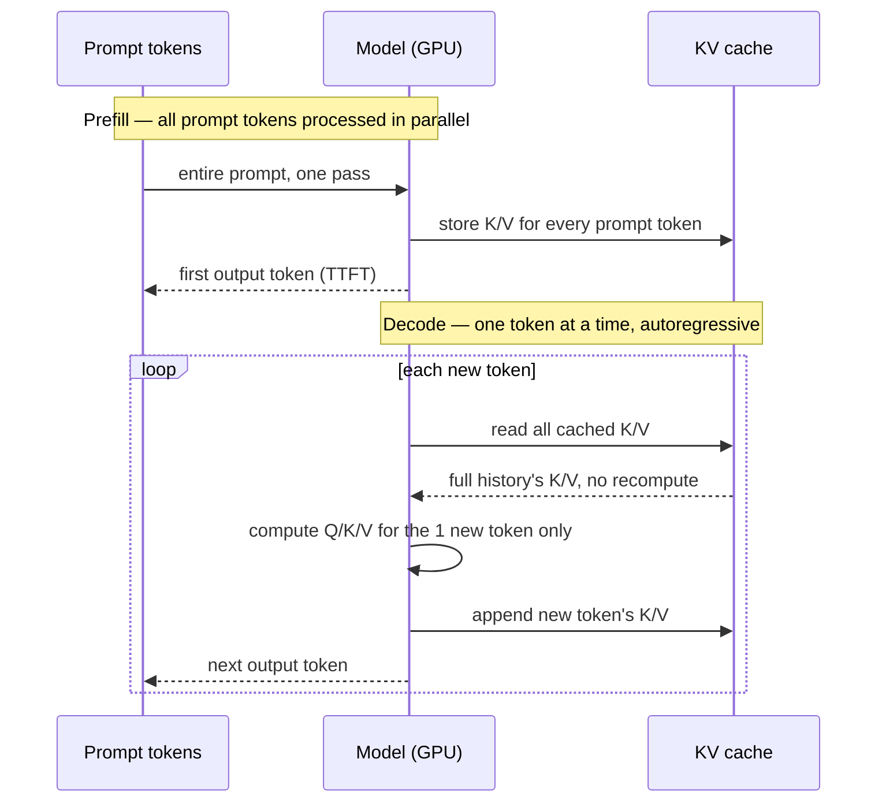

# Prefill, decode, and the KV cache

Every LLM inference call runs through two distinct phases with very different performance characteristics — **prefill** (processing your whole prompt at once) and **decode** (generating the reply one token at a time) — and the **KV cache** is the memory trick that keeps decode from redoing prefill's work on every single new token.

## Prerequisites
- [[transformer-architecture-and-attention]]
- [[how-llms-generate-text]]

## In plain English

[[how-llms-generate-text]] describes generation as autoregressive — one token at a time, each depending on everything before it. What that page treats as a single loop is actually two mechanically different phases under the hood.

**Prefill** happens first: the entire prompt (system message, history, the user's new message — everything described in [[context-windows-and-limits]]) gets run through the model's Transformer blocks *in parallel*, computing self-attention across the whole input at once, since every prompt token is already known up front. This phase is **compute-bound** — it's a large, parallelizable matrix-multiplication workload, and it determines **time-to-first-token (TTFT)**: how long you wait before the reply starts appearing at all.

**Decode** happens next, and it's fundamentally different: the model generates the reply one token at a time, and — because generation is autoregressive — it cannot compute token 51 until token 50 has actually been chosen. Each decode step is a much smaller amount of raw computation than prefill, but it can only happen one step after the last, and every step has to reload the model's weights from GPU memory to run. This makes decode **memory-bandwidth-bound** rather than compute-bound — the bottleneck isn't how fast the GPU can multiply matrices, it's how fast it can move weights and cached data through memory, once per token.

Here's the expensive part decode would otherwise repeat: self-attention for a new token needs to compare against the Key and Value vectors ([[transformer-architecture-and-attention]]) of *every* token that came before it — including the entire prompt. Recomputing all of those Keys and Values from scratch on every single decode step would mean redoing prefill's work again and again. The **KV cache** avoids this: once a token's Key and Value vectors are computed (during prefill, for the prompt; during decode, for each newly generated token), they're stored in GPU memory and reused for every subsequent step — a decode step only has to compute Q/K/V for the *one new token*, then attend against everything already sitting in the cache. This is what makes decode tractable at all, but it comes with a real cost: the KV cache grows with every token generated, and its size scales with sequence length × number of layers × number of attention heads — which is exactly why a longer context window isn't just a bigger number in a spec sheet, it's more GPU memory the server has to hold for the entire duration of your request (see the extended discussion in [[context-windows-and-limits]]).



## Core mechanics

| Concept | What it means |
|---|---|
| Prefill | Processing the entire input prompt in one parallel pass through the model — compute-bound, determines time-to-first-token |
| Decode | Generating the reply one token at a time, each step depending on the last — memory-bandwidth-bound, determines inter-token latency (tokens/sec after the first one) |
| Time-to-first-token (TTFT) | How long a request waits before any output appears — dominated by prefill cost, which scales with prompt length |
| Inter-token latency | The time between each subsequently generated token during decode |
| KV cache | Stored Key and Value vectors ([[transformer-architecture-and-attention]]) for every token processed so far, so each new decode step attends against cached history instead of recomputing it |
| KV cache growth | Cache size scales with sequence length × number of layers × number of attention heads — a longer context or a longer generated reply both grow it, and it occupies GPU memory for the request's entire duration |
| Compute-bound vs. memory-bound | Prefill's bottleneck is raw matrix-multiply throughput; decode's bottleneck is how fast cached data and weights move through GPU memory per step — different phases hit different hardware limits |

### Sizing the KV cache

The "sequence length × layers × heads" growth in the table above is a real, calculable number of bytes — this is what a serving system has to actually reserve in GPU memory per request:

```
KV cache size (bytes) = 2 × seq_len × n_layers × n_kv_heads × head_dim × bytes_per_param
```

- **2** — one set for Keys, one for Values
- **seq_len** — tokens cached so far (grows by 1 every decode step)
- **n_layers** — every Transformer block has its own K/V, so cache size multiplies by depth, not just width
- **n_kv_heads × head_dim** — together these equal the model's hidden dimension (fewer effective KV heads under grouped-query attention, a common optimization, shrinks this term directly)
- **bytes_per_param** — 2 bytes for fp16/bf16 (the common case), 1 for int8, 4 for fp32

Worked example: a ~7B-parameter model (32 layers, hidden dim 4096, fp16) at a 100K-token context:
`2 × 100,000 × 32 × 4096 × 2 bytes ≈ 52 GB` — for **one** request's cache alone, on top of the model's own weights sitting in memory. This is the concrete reason a bigger advertised context window doesn't mean a server can casually run many such requests concurrently — it's a real, per-request memory bill, and it's exactly the pressure [[paged-attention-and-efficient-serving]] addresses.

## Sample code

There's no lab cell demonstrating this — this course's labs call managed inference APIs (Groq, Gemini) where prefill/decode/KV-cache management happens entirely server-side and isn't exposed as a knob. The mechanism worth internalizing is the shape of what the KV cache avoids recomputing:

```python
# Without a KV cache: every decode step recomputes attention
# over the ENTIRE sequence so far, including the whole prompt again.
def decode_step_naive(all_tokens_so_far, model):
    K, V = model.compute_keys_and_values(all_tokens_so_far)  # full recompute, every step
    return model.attend_and_predict_next(all_tokens_so_far, K, V)

# With a KV cache: only the newest token's K/V get computed;
# everything before it is a cache read, not a recompute.
def decode_step_cached(new_token, kv_cache, model):
    new_k, new_v = model.compute_keys_and_values(new_token)   # just 1 token's worth
    kv_cache.append(new_k, new_v)
    return model.attend_and_predict_next(new_token, kv_cache)
```

## How this shows up in the capstone

Groq and Gemini manage prefill/decode/KV-cache internally as part of their served inference — nothing in the capstone configures this directly. What it *does* explain is why Milestone 1's cost/latency comparison sees TTFT and per-token latency behave differently across providers and prompt lengths (see [[model-selection-cost-latency-tradeoffs]]): those two numbers are dominated by different phases of inference, not one uniform "speed."

## Interview fire round

- **Q: Why does a long prompt slow down the start of a response, but a long *reply* slows down the rest of it?**
  A: Prompt length drives prefill cost (compute-bound, parallel — determines TTFT); reply length drives how many sequential decode steps happen (memory-bandwidth-bound, one token at a time — determines total generation time after the first token). They're different phases with different bottlenecks.
- **Q: What problem does the KV cache actually solve?**
  A: Without it, generating token N would require recomputing Key/Value vectors for all N-1 prior tokens from scratch, every single step — the KV cache stores those vectors once and reuses them, so each decode step only computes K/V for the one new token.
- **Q: Why does a bigger context window have a real memory cost on the server, not just a "more tokens allowed" cost?**
  A: The KV cache has to hold Key/Value vectors for every token in the context, for the entire duration of the request — cache size scales with sequence length (plus model depth and head count), so a longer context means more GPU memory reserved per concurrent request, which is a hardware capacity constraint, not just an abstract token limit.

## Production gotchas & best practices

- Production practice: TTFT and inter-token (decode) latency are different metrics that respond to different levers — reducing prompt size helps TTFT; nothing about a shorter prompt speeds up decode, since decode's cost scales with *reply* length and cached history size, not prompt length alone.
- Production practice: KV cache memory is the primary reason a serving system can't simply run unlimited concurrent long-context requests on fixed GPU memory — this is exactly the problem [[paged-attention-and-efficient-serving]] addresses next.
- Gotcha worth flagging in any system-design discussion: "the model has a 1M-token context window" doesn't mean every concurrent request can actually use the full window simultaneously on real hardware — KV cache memory is a shared, finite resource across all requests being served at once.

## Course vs. production

The labs never touch inference-serving internals — every call is to a managed API where prefill/decode/KV-cache behavior is entirely the provider's concern. In production ML infrastructure roles (distinct from the application-layer agent engineering this course teaches), these two phases and the KV cache are exactly what's being profiled, batched, and optimized — and it's foundational vocabulary for understanding *why* providers price and rate-limit inference the way they do, even from the application side.

## Related
- **Builds on** — [[transformer-architecture-and-attention]], [[how-llms-generate-text]]
- **Feeds into** — [[paged-attention-and-efficient-serving]], [[context-windows-and-limits]]

## Sources

**Web sources**
- [Kwon et al. — Efficient Memory Management for Large Language Model Serving with PagedAttention (arXiv 2309.06180)](https://arxiv.org/abs/2309.06180) — prefill/decode phase distinction and KV cache mechanics, covered as background before introducing PagedAttention, accessed 2026-08-24
- [NVIDIA Technical Blog — Mastering LLM Techniques: Inference Optimization](https://developer.nvidia.com/blog/mastering-llm-techniques-inference-optimization/) — TTFT vs. inter-token latency, compute-bound vs. memory-bound phase framing, accessed 2026-08-24
