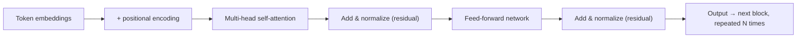

# Transformer architecture and attention

The Transformer is the neural network architecture nearly every current LLM is built from, and its defining trick is **self-attention** — letting every token in a sequence directly weigh every other token when deciding what it means in context, instead of processing text strictly left-to-right like older architectures did.

## Prerequisites
- [[neural-network-basics]]
- [[tokens-and-tokenization]]

## In plain English

Before the Transformer (introduced in 2017), sequence models like RNNs processed text one token at a time, in order, carrying a compressed summary forward — which made it hard for a token near the end of a long input to "remember" something specific from near the beginning. The Transformer's answer was **self-attention**: instead of compressing history into one running summary, every token gets to look directly at every other token in the input and decide how much each one matters for understanding itself, all at once, in parallel.

Mechanically, each token's embedding is projected into three vectors: a **Query** (what this token is looking for), a **Key** (what this token offers to others looking), and a **Value** (the actual content this token contributes if attended to). Attention for one token is computed by comparing its Query against every other token's Key (how relevant is that other token to me?), turning those comparisons into weights, and using those weights to blend all the Values into a new, context-aware representation of this token. Do this with several independent sets of Q/K/V projections at once — **multi-head attention** — and different heads can specialize in different kinds of relationships (e.g. one head tracking grammatical subject-verb agreement, another tracking a pronoun's referent).

Because raw self-attention has no built-in sense of word order (it's comparing every token to every other token symmetrically), **positional encoding** is added to each token's embedding before attention runs, injecting information about where in the sequence each token sits. A full Transformer block layers self-attention with a plain feed-forward neural network (see [[neural-network-basics]]) applied to each token independently, wraps both in **residual connections** (the block's input is added back to its output, which keeps gradients flowing cleanly through very deep stacks) with normalization in between, and stacks many of these blocks — dozens, in a large model. Most current LLMs (including this stack's Groq-served Llama models) are **decoder-only**: a stack of blocks where each token can only attend to tokens before it, not after — the architectural reason generation is naturally left-to-right, one token predicting the next, as covered in [[how-llms-generate-text]].



## Core mechanics

| Concept | What it means |
|---|---|
| Embedding | The learned numeric vector representing one token before any attention is applied |
| Positional encoding | Information about a token's position in the sequence, added to its embedding — without it, self-attention can't tell word order apart |
| Query / Key / Value (Q/K/V) | Three learned projections of each token's embedding — Query = what this token looks for, Key = what this token offers, Value = the content contributed if attended to |
| Self-attention | For each token, compare its Query against every other token's Key, weight the Values accordingly, and blend them into a new context-aware representation — an all-pairs comparison across the sequence |
| Multi-head attention | Several independent Q/K/V attention computations run in parallel per block, letting different heads specialize in different relationships between tokens |
| Feed-forward sublayer | A plain neural network (see [[neural-network-basics]]) applied identically to every token's representation, after attention has mixed information across tokens |
| Residual connection | Adding a sublayer's input back to its output — keeps gradients from vanishing across many stacked blocks during training |
| Decoder-only architecture | Each token can only attend to itself and earlier tokens, never later ones — the architecture nearly all current chat/completion LLMs use, and why generation proceeds strictly left-to-right |

## Sample code

There's no lab cell demonstrating this — this course's labs and presentation decks never build or inspect a Transformer directly; they call already-trained models via API. The mechanism worth internalizing is the shape of the self-attention computation itself:

```python
import numpy as np

def self_attention(Q, K, V):
    """
    Q, K, V: arrays of shape (sequence_length, head_dim).
    Returns a new (sequence_length, head_dim) representation where
    every token's output is a weighted blend of every token's Value.
    """
    scores = Q @ K.T / np.sqrt(K.shape[-1])   # every token vs. every token
    weights = softmax(scores, axis=-1)         # per-row probability distribution
    return weights @ V                         # weighted blend of Values
```

The `Q @ K.T` step is exactly why self-attention cost scales with the square of sequence length — this is the same all-pairs comparison [[context-rot-and-long-context-management]] cites as the mechanical reason doubling input tokens roughly quadruples attention computation.

## How this shows up in the capstone

Nothing in the capstone builds or fine-tunes a Transformer — Groq and Gemini are called as managed inference endpoints (see [[what-is-an-llm]]). This page is background/interview theory that explains *why* the models behind those API calls behave the way they do: why context length has a real computational cost (see [[prefill-decode-and-kv-cache]]), and why "attention" is the term used throughout this KB's discussion of context rot and long-context degradation.

## Interview fire round

- **Q: What problem does self-attention solve that older sequence models (RNNs) struggled with?**
  A: RNNs process tokens strictly in order, compressing everything seen so far into one running summary — information from early in a long sequence can get diluted by the time a later token needs it. Self-attention lets every token directly compare against every other token, regardless of distance, and it can also be computed in parallel rather than one step at a time.
- **Q: Why does a Transformer need positional encoding at all if self-attention already looks at every token?**
  A: Self-attention's comparisons (Query vs. Key) are symmetric — nothing about the raw computation encodes *where* a token sits in the sequence. Positional encoding is added specifically to give the model that ordering information, since word order changes meaning even when the same tokens are present.
- **Q: What does "decoder-only" mean, and why do most current LLMs use it?**
  A: Each token can only attend to itself and tokens before it, never tokens after — a hard architectural constraint (via attention masking). This matches exactly how generation works: predicting the next token given only what's been generated so far (see [[how-llms-generate-text]]), so it's the natural fit for chat/completion models.

## Production gotchas & best practices

- Production practice: self-attention's O(n²) cost in sequence length is the root cause behind why long-context requests get both slower and more expensive, not just "more tokens" in a linear sense — worth citing precisely rather than hand-waving "long context is slow" in a design discussion.
- Production practice: multi-head attention is why a single "attention score" isn't a meaningful debugging artifact on its own — different heads can be attending to completely different relationships, so tooling that visualizes attention (when available) needs to be read per-head, not averaged into one number.

## Course vs. production

The labs and decks treat the Transformer as a black box behind an API call — appropriate for a course focused on building agent systems on top of foundation models, not on training them. In production ML/infra roles (as opposed to the application-layer agent engineering this course teaches), this architecture is exactly what's being optimized, quantized, and served efficiently — which is the subject the next two pages, [[prefill-decode-and-kv-cache]] and [[paged-attention-and-efficient-serving]], pick up.

## Related
- **Builds on** — [[neural-network-basics]], [[tokens-and-tokenization]]
- **Feeds into** — [[how-llms-generate-text]], [[prefill-decode-and-kv-cache]], [[context-rot-and-long-context-management]]

## Sources

**Web sources**
- [Vaswani et al. — Attention Is All You Need (arXiv 1706.03762)](https://arxiv.org/abs/1706.03762) — the original Transformer architecture paper: Q/K/V self-attention, multi-head attention, positional encoding, encoder-decoder design, accessed 2026-08-24
- [Jay Alammar — The Illustrated Transformer](https://jalammar.github.io/illustrated-transformer/) — the visual walkthrough of self-attention and multi-head attention this page's plain-English section follows, accessed 2026-08-24
